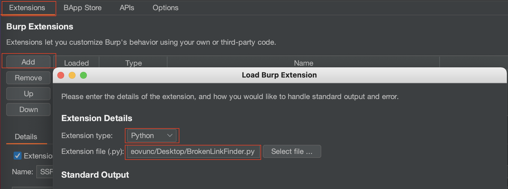
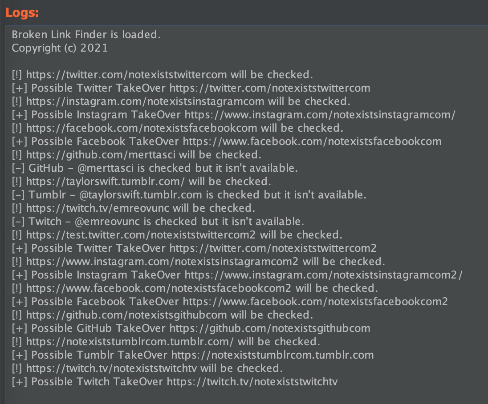

## Broken Link Finder

Broken Link Finder is a Burp Extension to detect broken links for a passive scanning domains and links. Inspired by InitRoot's linkfinder plugin.

It covers:
- [x] Twitter
- [x] Twitch
- [x] Facebook
- [x] Instagram
- [x] Github
- [x] Tumblr

Note: We know there is a rate limiting issue, and we will work to bypass it.

## Usage

Extender >> Add
- Extension Type: Python
- Extension File: BrokenLinkFinder.py

## Output

